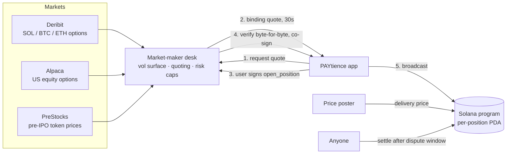

# PAYtience

**Get paid while you wait.**

PAYtience lets anyone on Solana earn yield **upfront** by committing to *sell an asset higher* or *buy it lower* than today's price. You pick a target price and a date, sign once, and the yield lands in your wallet in the same transaction. When the date comes, you either keep your asset or swap it at the price you chose. In both cases you keep the yield.

It works for SOL, bridged BTC and ETH, tokenized US stocks (TSLA, NVDA, SPY, …) and pre-IPO tokens (SpaceX, Anthropic, OpenAI, …).

**Live app (Solana devnet):** https://app.paytience.app

| Repo | What it is |
| --- | --- |
| [dashboard-breezepocket](https://github.com/BreezePocket/dashboard-breezepocket) (this repo) | The PAYtience web app |
| [core](https://github.com/BreezePocket/core) | Anchor program: atomic lock, upfront yield, permissionless settlement |
| [MM-system-breezepocket](https://github.com/BreezePocket/MM-system-breezepocket) | Market-maker desk: prices off real option markets and co-signs trades |

---

## The problem

Covered calls and cash-secured puts are the most popular income strategies in traditional finance. Most people still never use them, for three reasons:

- **The jargon.** Strikes, greeks and option chains scare off most retail users.
- **The venues.** Options live on centralized exchanges with KYC, margin accounts and custody risk.
- **The payout.** On-chain option vaults usually pay out at the end of an epoch, pool everyone's funds together and set prices in ways users can't see.

## The solution

PAYtience keeps what the strategy does and drops the complexity around it:

| You say | Under the hood | You get |
| --- | --- | --- |
| **Sell High:** "I'd sell my SOL at $250 by Friday" | Covered call | Yield paid in SOL, now |
| **Buy Low:** "I'd buy SOL at $180 by Friday" | Cash-secured put | Yield paid in USDC, now |

- **Upfront yield.** You're paid when you sign, not at the end of an epoch.
- **Priced by real markets.** Every yield comes from live option marks (Deribit or US equity options), and each quote shows its source, instrument and implied vol.
- **Non-custodial and isolated.** Each position is its own on-chain account holding both sides of the trade. There's no pooled vault.
- **Trustless settlement.** Once the price is posted, anyone can settle. Nobody has to trust us to pay out.
- **Gasless for users.** The market maker pays the transaction fee and the account rent.

---

## How it works



### 1. Pricing: every commitment is a listed option

The desk prices each commitment as the option it actually is:

- **SOL, BTC, ETH.** Live marks from Deribit's USDC option chains. If the strike and expiry you ask for aren't listed, the desk builds a volatility surface: it interpolates in log-moneyness across strikes and in total variance (`iv²·T`) across expiries, then reprices with Black-76 against that expiry's forward.
- **Tokenized US stocks.** Alpaca option quotes. The free feed has no implied vol, so the desk **inverts Black-76** from each mid-price, and takes the forward from put-call parity (`F = K + C − P`).
- **Pre-IPO tokens.** No option market exists, so these use a clearly labeled synthetic chain.

**Yield = fair option value × (1 − protocol fee).** Every quote returns its `price_source`, `instrument`, `implied_vol`, `index_price` and `fee_pct`, so users can see exactly where the number came from.

### 2. Opening a position: a co-signer that trusts nothing

The desk's signature moves the desk's funds, so it treats every transaction as hostile until proven otherwise. Before co-signing it checks that:

- the decoded price, expiry, amount, yield and nonce **match the quote byte for byte**, and the quote is unused and unexpired
- every account equals the address the program will derive, so no funds can be redirected
- the transaction contains only `open_position` plus compute-budget instructions, with the desk as fee payer
- the user's signature is valid, spot hasn't moved past a threshold, and exposure caps still hold

Then both sides of the trade lock **atomically** in one transaction, and the user's yield is paid in that same transaction.

### 3. Settlement: permissionless and on chain

- At expiry a price poster records the official delivery price: Deribit's 08:00 UTC price for crypto, 20:00 UTC for US equities.
- After a **30-minute dispute window**, anyone can call `settle`. The program pays out both sides by the fixed rules below and closes the accounts.
- A **3-of-5 governance multisig** can list new SPL assets, override a bad price, or emergency-cancel a position and return both sides of the trade.

| | Sell High | Buy Low |
| --- | --- | --- |
| User locks | the asset | USDC |
| Market maker locks | asset amount × target price in USDC | USDC ÷ target price in the asset |
| Price never reaches target | user gets the asset back | user gets USDC back |
| Price reaches target | user receives the USDC | user receives the asset |
| Upfront yield | **kept in every outcome** | **kept in every outcome** |

---

## Technical highlights

- **Anchor program** with per-position PDAs, dual-signed atomic open, permissionless settle, governance-listed SPL assets, and emergency cancel. Covered by **51 LiteSVM tests**: every instruction × every outcome and guard.
- **Real-market pricing engine:** a Deribit surface built by log-moneyness and total-variance interpolation, Black-76 vol inversion for US equities, and forwards from put-call parity.
- **Risk controls:** caps per position, per expiry and in total, calculated from on-chain exposure plus recently signed quotes, with staleness guards on every price feed.
- **24 assets listed on devnet.** The desk quotes all of them live.
- **Frontend:** Vite, React, TypeScript and the Solana wallet adapter (Phantom, Solflare, Backpack). Positions are read directly from chain with the Anchor IDL.

## Status

| | |
| --- | --- |
| SOL Sell High / Buy Low | **Live end to end on devnet:** quote → sign → co-sign → settle |
| WBTC, WETH, tokenized stocks, pre-IPO tokens | Listed on chain and quoted live by the desk. Frontend trading is being rolled out. |
| Settlement price posting | Manual scripts today; an automated oracle job is next |

**Honest caveats:** this is devnet with a test USDC mint. The Alpaca feed is indicative, not consolidated OPRA. Pre-IPO pricing comes from a synthetic chain.

## Roadmap

1. Mainnet launch with SOL, then tokenized stocks and bridged BTC/ETH
2. Automated settlement oracle (a Deribit delivery-price poster)
3. Open RFQ, so multiple market makers compete on every quote
4. Thesis Vaults: strategy vaults such as PAXG, TSLA and HYNIX that run automatically

---

## Try it

1. Open https://app.paytience.app and connect a Solana wallet set to **devnet**.
2. Click **Get test USDC + SOL** on the Earn page.
3. Choose **Sell High** or **Buy Low** on SOL, pick an expiry and a target price, enter an amount and sign.
4. Your yield arrives immediately. The position appears on **Dashboard**, where it can be settled after expiry.

## Deployment (devnet)

| | |
| --- | --- |
| Program | `BeytdpJYSGP1oFRxEiBLkSRGuW6HW3Pk9dqSZCuSteQ9` |
| GlobalConfig | `BejjQ3MwvvFwaP3FxyDjj7Cu4gBMrH5Txr5xuCR32THp` |
| Test USDC mint | `GxSfF7CfT3C2Sr7RYFwXoRHmhFeH4DpUVQCDNiktxEFD` |

---

## Developer guide

### Run the app

```bash
npm install
npm run dev          # http://localhost:5173
```

The RPC defaults to public devnet. Set `VITE_SOLANA_RPC` / `VITE_SOLANA_WS` in `.env` for a keyed endpoint.

### Run the desk

```bash
cd ../MM-system-breezepocket
npm start                                        # PRICE_SOURCE=deribit; REST on :8787
cloudflared tunnel --url http://localhost:8787   # public URL for the deployed app
```

The app finds the desk in this order: `?mm=<url>` (remembered in localStorage), then `VITE_MM_URL` from the build, then `http://localhost:8787`.

Desk endpoints the app uses: `GET /expiries`, `GET /board`, `GET /assets`, `POST /rfq`, `POST /sign`, `POST /faucet`.

### Routes

| Path | What it shows |
| --- | --- |
| `/` | Earn: asset table with Sell High and Buy Low tabs |
| `/earn?asset=…&type=call\|put` | Strike picker, amount, upfront-yield preview and payoff summary |
| `/vaults`, `/vault/:id` | Thesis Vaults (preview) |
| `/dashboard` | Income, chart and positions, with **Settle** once a price is posted. `?as=<pubkey>` views any wallet read-only. |
| `/points`, `/leaderboard` | Points, referrals and leaderboard (preview) |

Key files: `src/pages/EarnDetail.tsx` (quote and open flow), `src/lib/program.ts` (on-chain client), `src/lib/mm.ts` (desk client), `src/idl/` (Anchor IDL).

### Deploy

Hosted on Cloudflare Pages at https://app.paytience.app (also https://breezepocket-app.pages.dev).

```bash
npm run deploy
```

`public/_redirects` sends every path to `index.html` for client-side routing. `public/_headers` sets long-lived caching for hashed assets.

### Placeholder data

The Vaults, Points and Leaderboard pages use static preview data in `src/data/` and the page files.
